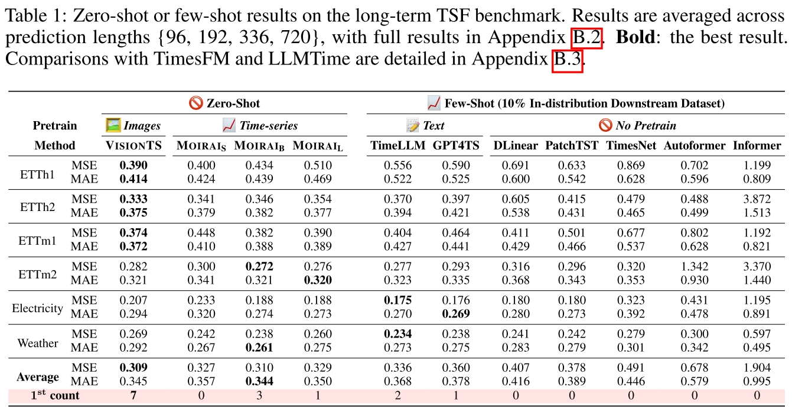

<div align="center">


# VisionTS


_Visual Masked Autoencoders Are Free-Lunch Zero-Shot Time Series Forecasters_

[](https://arxiv.org/abs/2408.17253)
[](#-quick-start)

</div>

<p align="center">
    🔍&nbsp;<a href="#-about">About</a>
    | 🚀&nbsp;<a href="#-quick-start">Quick Start</a>
    | 📊&nbsp;<a href="#-evaluation">Evaluation</a>
    | 🔗&nbsp;<a href="#-citation">Citation</a>
</p>


## 🔍 About


- We propose **VisionTS**, a time series forecasting (TSF) foundation model building from rich, high-quality *natural images* 🖼️. 

  - This is conceptually different from the existing TSF foundation models (*text-based* 📝 or *time series-based* 📈), but it shows a comparable or even better performance **without any adaptation on time series data**.

<div align="center">

</div>

- We reformulate the TSF task as an image reconstruction task, which is further processed by a visual masked autoencoder ([MAE](https://arxiv.org/abs/2111.06377)). 

<div align="center">

</div>

## 🚀 Quick Start

We have uploaded our package to PyPI. Please first install [pytorch](https://pytorch.org/get-started/locally/), then running the following command for installing **VisionTS**:

```bash
pip install visionts
```

Then, you can refer to [demo.ipynb](demo.ipynb) about forecasting time series using **VisionTS**, with a clear visualization of the image reconstruction. 


## 📊 Evaluation

Our repository is built on [Time-Series-Library](https://github.com/thuml/Time-Series-Library), [MAE](https://github.com/facebookresearch/mae), and [GluonTS](https://github.com/awslabs/gluonts). Please install the dependencies through `requirements.txt` before running the evaluation.

#### Long-Term TSF Benchmarks (Zero-Shot)

<div align="center">

</div>


We evaluate our methods on 6 long-term TSF benchmarks for zero-shot forecasting. The scripts are under `long_term_tsf/scripts/vision_ts_zeroshot`. Before running, you should first follow the instructions of [Time-Series-Library](https://github.com/thuml/Time-Series-Library) to download datasets into `long_term_tsf/dataset`. Using the following command for reproduction:


```bash
cd long_term_tsf/
bash scripts/vision_ts_zeroshot/$SOME_DATASET.sh
```

#### Monash (Zero-Shot)

<div align="center">

</div>


We evaluate our methods on 29 Monash TSF benchmarks. You can use the following command for reproduction, where the benchmarks will be automatically downloaded.


```bash
cd monash/
python run.py
```

#### Long-Term TSF Benchmarks (Full-Shot)


We evaluate our methods on 8 long-term TSF benchmarks for full-shot forecasting. The scripts are under `long_term_tsf/scripts/vision_ts_fullshot`. Using the following command for reproduction:


```bash
cd long_term_tsf/
bash scripts/vision_ts_fullshot/$SOME_DATASET.sh
```


## 🔗 Citation

```bibtex
@misc{chen2024visionts,
      title={VisionTS: Visual Masked Autoencoders Are Free-Lunch Zero-Shot Time Series Forecasters}, 
      author={Mouxiang Chen and Lefei Shen and Zhuo Li and Xiaoyun Joy Wang and Jianling Sun and Chenghao Liu},
      year={2024},
      eprint={2408.17253},
      archivePrefix={arXiv},
      url={https://arxiv.org/abs/2408.17253}, 
}
```

## ⭐ Star History

    
<div align="center">
    <a href="https://star-history.com/#Keytoyze/VisionTS&Timeline">
        
    </a>
</div>


