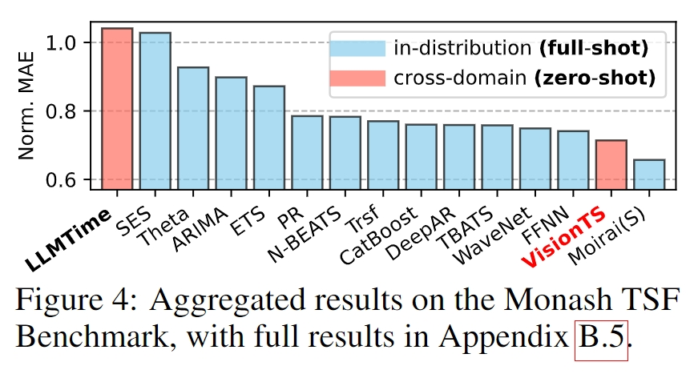

<div align="center">


# VisionTS


_Visual Masked Autoencoders Are Free-Lunch Zero-Shot Time Series Forecasters_

</div>


<p align="center">
    📃&nbsp;<a href="">Paper</a>
    | 🔍&nbsp;<a href="#-about">About</a>
    | 🔨&nbsp;<a href="#-setup">Setup</a>
    | 🚀&nbsp;<a href="#-quick-start">Quick Start</a>
    | 📊&nbsp;<a href="#-evaluation">Evaluation</a>
    | 🔗&nbsp;<a href="#-citation">Citation</a>
</p>


## 🔍 About


- **TL;DR**: We propose **VisionTS**, a new road to building *zero-shot* foundation model for time series forecasting (TSF) based on *natural images*. 

  - This road is conceptually different from the existing roads to building TSF foundation models (*Text-based* and *Time series-based* methods), but it shows a comparable or even better performance.


- **How it work**: we reformulate the TSF task as an image reconstruction task, which is further processed by a visual masked autoencoder ([MAE](https://arxiv.org/abs/2111.06377)). 


## 🔨 Setup


Our repository is built on [Time-Series-Library](https://github.com/thuml/Time-Series-Library), [MAE](https://github.com/facebookresearch/mae), and [GluonTS](https://github.com/awslabs/gluonts). Please install the dependencies through `requirements.txt`.


## 🚀 Quick Start


Please refer to [demo.ipynb](demo.ipynb) for a quick start on how to forecast time series using **VisionTS**, with a clear visualization of the reconstructed images. Our main code is under [visionts](visionts) directory.


## 📊 Evaluation


#### Monash (Zero-Shot)





We evaluate our methods on 29 Monash TSF benchmarks. Using the following command for reproduction, where the benchmarks will be automatically downloaded.


```bash
cd monash/
python run.py
```


#### Long-Term TSF Benchmarks (Zero-Shot)


We evaluate our methods on 6 long-term TSF benchmarks for zero-shot forecasting. The scripts are under `long_term_tsf/scripts/vision_ts_zeroshot`. Before running, you should first follow the instructions of [Time-Series-Library](https://github.com/thuml/Time-Series-Library) to download datasets into `long_term_tsf/dataset`. Using the following command for reproduction:


```bash
cd long_term_tsf/
bash scripts/vision_ts_zeroshot/$SOME_DATASET.sh
```


#### Long-Term TSF Benchmarks (Full-Shot)


We evaluate our methods on 8 long-term TSF benchmarks for full-shot forecasting. The scripts are under `long_term_tsf/scripts/vision_ts_fullshot`. Using the following command for reproduction:


```bash
cd long_term_tsf/
bash scripts/vision_ts_fullshot/$SOME_DATASET.sh
```


## 🔗 Citation

TODO

(Currently, our paper is unfortunately *on hold* in arXiv).

